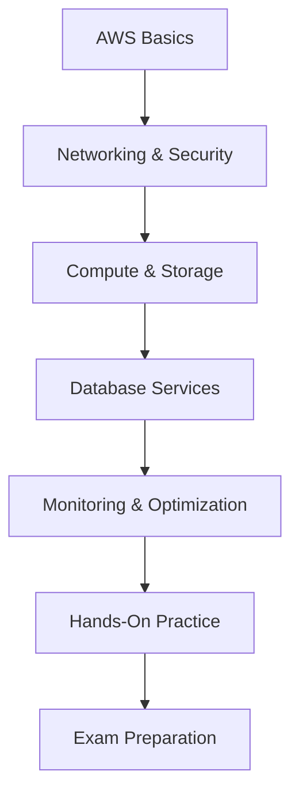

# AWS Certification Path Guide

## Why Learn AWS Services?
AWS services are the backbone of modern cloud computing. Learning these services enables you to:
- Design scalable and secure architectures.
- Optimize costs and performance.
- Build resilient applications.
- Stay competitive in the IT industry.

---

## AWS Certification Learning Flow

---

## Step-by-Step Learning Path

### 1. **Understand AWS Basics**
- Learn about AWS Regions and Availability Zones
- Explore the AWS Free Tier
- Get familiar with the AWS Management Console and CLI
- Study core services: EC2, S3, RDS

### 2. **Networking and Security**
- Understand VPC, subnets, route tables, and security groups
- Learn IAM: users, groups, roles, policies, MFA
- Explore AWS KMS, Shield, WAF, and GuardDuty
- Practice setting up secure network architectures

### 3. **Compute and Storage**
- Deep dive into EC2 instance types, Auto Scaling, and Load Balancing
- Learn about Lambda, ECS, EKS, Elastic Beanstalk, and Fargate
- Study S3 bucket policies, lifecycle rules, storage classes, EBS, EFS, FSx, and Glacier
- Practice deploying and managing compute and storage resources

### 4. **Database Services**
- Learn about RDS, DynamoDB, Aurora, Redshift, ElastiCache, DocumentDB, Neptune, QLDB, Keyspaces
- Understand database migration strategies (DMS)
- Practice launching and connecting to managed databases

### 5. **Monitoring and Optimization**
- Use CloudWatch for monitoring metrics and logs
- Explore CloudTrail, Config, Trusted Advisor, and Systems Manager
- Learn cost optimization techniques and use the AWS Pricing Calculator
- Set up alarms, dashboards, and compliance checks

### 6. **Hands-On Practice**
- Create and manage EC2 instances
- Set up a VPC with public and private subnets
- Deploy a web application using Elastic Beanstalk
- Implement IAM roles and policies
- Launch and connect to RDS/Aurora databases
- Monitor resources with CloudWatch and Trusted Advisor

### 7. **Exam Preparation**
- Review AWS whitepapers and FAQs
- Take practice exams and quizzes
- Use AWS Skill Builder and official training
- Focus on exam blueprints and key topics

---

## Certification Levels

### Foundational:
- AWS Certified Cloud Practitioner

### Associate:
- AWS Certified Solutions Architect – Associate
- AWS Certified Developer – Associate
- AWS Certified SysOps Administrator – Associate

### Professional:
- AWS Certified Solutions Architect – Professional
- AWS Certified DevOps Engineer – Professional

### Specialty:
- Security, Advanced Networking, Machine Learning, Data Analytics, and more

---

## Resources
- **Official AWS Training**: [AWS Training and Certification](https://aws.amazon.com/training/)
- **Whitepapers**: [AWS Whitepapers](https://aws.amazon.com/whitepapers/)
- **Practice Exams**: [AWS Practice Exams](https://aws.amazon.com/certification/)
- **AWS Documentation**: [AWS Docs](https://docs.aws.amazon.com/)
- **AWS Skill Builder**: [Skill Builder](https://explore.skillbuilder.aws/)

---

## Tips for Success
- Focus on hands-on labs and real-world scenarios
- Understand the exam blueprint and key topics
- Regularly review AWS documentation and updates
- Join study groups and online communities
- Practice time management for the exam
